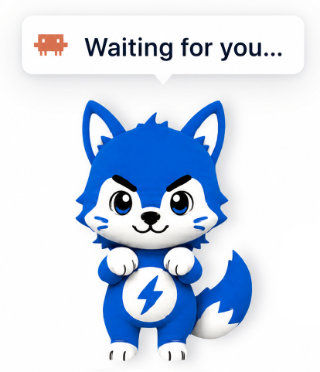
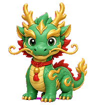
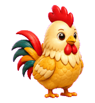

<div align="center">
  
  <h1>CoPet</h1>
  <p><strong>A living desktop companion for every AI Agent.</strong></p>
  <p>Powered by Codex-compatible pet packages, CoPet reacts in real time to Claude Code, Codex, Antigravity, OpenCode, Cursor, Copilot CLI, Pi, and Gemini, turning prompts, tool use, waiting, and completions into lively pet reactions on your desktop.</p>
</div>


[简体中文](./README.zh.md)

Built with Tauri, Rust, and React. Lightweight, local-first, no cloud.

## Built-in pets

<table>
  <tr>
    <td align="center"><br><sub>CoPet Neo</sub></td>
    <td align="center"><br><sub>CoPet Nia</sub></td>
    <td align="center"><br><sub>CoPet Mecha</sub></td>
    <td align="center"><br><sub>DJ Fuzz</sub></td>
    <td align="center"><br><sub>Lucky Dog</sub></td>
  </tr>
  <tr>
    <td align="center"><br><sub>Azure Dragon</sub></td>
    <td align="center"><br><sub>Waddly Duck</sub></td>
    <td align="center"><br><sub>Cloud Goat</sub></td>
    <td align="center"><br><sub>Goku</sub></td>
    <td align="center"><br><sub>Chestnut Horse</sub></td>
  </tr>
  <tr>
    <td align="center"><br><sub>Clever Monkey</sub></td>
    <td align="center"><br><sub>Orange Cat</sub></td>
    <td align="center"><br><sub>Cream Ox</sub></td>
    <td align="center"><br><sub>Panda</sub></td>
    <td align="center"><br><sub>Blush Pig</sub></td>
  </tr>
  <tr>
    <td align="center"><br><sub>White Rabbit</sub></td>
    <td align="center"><br><sub>Pearl Rat</sub></td>
    <td align="center"><br><sub>Golden Rooster</sub></td>
    <td align="center"><br><sub>Jade Snake</sub></td>
    <td align="center"><br><sub>Striped Tiger</sub></td>
  </tr>
</table>

## Features

- Real-time pet reactions to Agent prompts, tool use, waiting, completion, and errors.
- Integrations for Claude Code, Codex, Antigravity, OpenCode, Cursor, Copilot CLI, Pi, and Gemini.
- Built-in pets plus import support for Codex-compatible pet packages.
- Rich pet interactions: hover, click, double-click, rapid-click petting, long-press, drag reactions, and native context menu.
- Global and per-pet sound packs for interactions and Agent states.
- Settings and tray controls for pet size, pet launch animation on app startup, Agent message display mode, hooks, sounds, language, visibility, and window position.
- Agent messages can show only the latest update or keep multiple Agent updates visible at once.
- Local-first data model in `~/.copet`, with safe hook backups, atomic writes, and no telemetry.

## Installation

| Platform | Download |
| --- | --- |
| macOS (Universal) | [CoPet-macos-universal.dmg](https://github.com/ChanceYu/CoPet/releases/latest/download/CoPet-macos-universal.dmg) |
| Windows x64 | [CoPet-windows-x64.exe](https://github.com/ChanceYu/CoPet/releases/latest/download/CoPet-windows-x64.exe) |

[All releases](https://github.com/ChanceYu/CoPet/releases)

### macOS

Drag `CoPet.app` into `/Applications`. The build is not notarized, so run once to clear the quarantine flag:

```bash
sudo xattr -rd com.apple.quarantine /Applications/CoPet.app
```

### Windows

Windows builds are not code-signed. SmartScreen may warn on first launch — click *More info* → *Run anyway*.

## Customize your pet

CoPet is not limited to built-in pets. The [CoPet Skill series](./skills/README.md) helps you turn a character idea, team mascot, or personal avatar into your own desktop companion:

- [`copet-gen`](./skills/copet-gen/SKILL.md) generates and installs custom CoPet pet packages with `pet.json` and `spritesheet.webp`, so your own pet can react to Agent activity.
- [`copet-sound`](./skills/copet-sound/SKILL.md) creates matching 11-clip MP3 sound packs for clicks, gestures, waiting, success, and error states.

Install CoPet Skills into Codex with either method.

From a terminal:

```bash
npx skills add ChanceYu/CoPet --skill '*' -a codex
```

Inside Codex:

```text
$skill-installer install all CoPet skills from https://github.com/ChanceYu/CoPet/tree/main/skills
```

Restart Codex if the newly installed Skills do not appear.

> **Codex only.** `copet-gen` delegates pet generation to the upstream `$hatch-pet` / `$imagegen` chain, which depends on Codex's built-in `image_gen` tool. Claude Code, Cursor, and other agents do not ship this tool, so the Skill is not supported there.

## Supported agents

| Agent | Integration | Default config path |
| --- | --- | --- |
| Claude Code | JSON hooks | `~/.claude/settings.json` |
| Codex | JSON hooks + trusted hook hashes | `~/.codex/hooks.json`, `~/.codex/config.toml` |
| Antigravity | JSON hooks | `~/.gemini/config/hooks.json` |
| OpenCode | JS plugin + config entry | `~/.config/opencode/plugins/copet.js`, `~/.config/opencode/opencode.json` |
| Cursor | JSON hooks | `~/.cursor/hooks.json` |
| Copilot CLI | JSON hook file | `~/.copilot/hooks/copet.json` |
| Pi | TypeScript extension | `~/.pi/agent/extensions/copet/index.ts` |
| Gemini | JSON hooks | `~/.gemini/settings.json` |

## Getting started

Prerequisites: [Rust](https://www.rust-lang.org/tools/install), [Node.js](https://nodejs.org/) with pnpm. Runs on macOS (primary), Windows, and Linux.

```bash
git clone https://github.com/ChanceYu/CoPet.git
cd CoPet
pnpm install
pnpm tauri:dev          # development
pnpm tauri:build        # production bundle
```

## Project layout

- `src-tauri/` — Rust core, agent adapters, runtime server.
- `src/` — React frontend (pet window + settings center).
- `src-tauri/assets/pets/` — built-in pet packages bundled with the app.
- `src-tauri/assets/sounds/` — built-in global sound packs bundled with the app.
- `skills/` — optional CoPet Skill docs for generating pets and 11-clip sound packs.
- `docs/architecture.md` — technical architecture and design.
- `AGENTS.md` — contributor guide and testing instructions.

## Security

- Event server binds only to `127.0.0.1`, requires a bearer token, rate-limits requests, and drops unknown payloads.
- All hook config changes are backed up before write and use atomic file ops.
- Pet and sound packages are treated as untrusted data and validated before use.
- `assetProtocol.scope` whitelists exactly which pet, sound, preview, and bundled resource directories the webview can read.

## Contributing

Issues and PRs welcome. Start with [AGENTS.md](AGENTS.md) for setup and conventions, and [docs/architecture.md](docs/architecture.md) for the system design.

## License

[MIT](LICENSE) © ChanceYu
