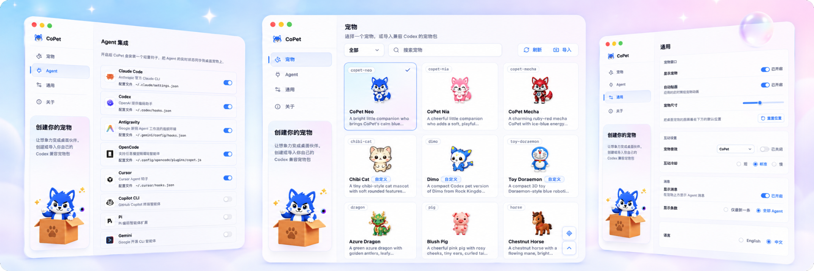

<div align="center">
  
  <h1>CoPet</h1>
  <p><strong>给 AI Agent 会话配一只会动的桌面宠物。</strong></p>
  <p>CoPet 使用兼容 Codex 的宠物包，实时感知 Claude Code、Codex、Antigravity、OpenCode、Cursor、Copilot CLI、Pi 和 Gemini 的提示、工具调用、等待、完成与错误状态，让宠物在桌面上跟着工作节奏做出反应。</p>
</div>



[English](./README.md)

基于 Tauri、Rust 和 React 构建。轻量、本地优先，不依赖云服务。

## 内置宠物

<table>
  <tr>
    <td align="center"><br><sub>CoPet Neo</sub></td>
    <td align="center"><br><sub>CoPet Nia</sub></td>
    <td align="center"><br><sub>CoPet Mecha</sub></td>
    <td align="center"><br><sub>DJ Fuzz</sub></td>
    <td align="center"><br><sub>Lucky Dog</sub></td>
  </tr>
  <tr>
    <td align="center"><br><sub>Azure Dragon</sub></td>
    <td align="center"><br><sub>Waddly Duck</sub></td>
    <td align="center"><br><sub>Cloud Goat</sub></td>
    <td align="center"><br><sub>Goku</sub></td>
    <td align="center"><br><sub>Chestnut Horse</sub></td>
  </tr>
  <tr>
    <td align="center"><br><sub>Clever Monkey</sub></td>
    <td align="center"><br><sub>Orange Cat</sub></td>
    <td align="center"><br><sub>Cream Ox</sub></td>
    <td align="center"><br><sub>Panda</sub></td>
    <td align="center"><br><sub>Blush Pig</sub></td>
  </tr>
  <tr>
    <td align="center"><br><sub>White Rabbit</sub></td>
    <td align="center"><br><sub>Pearl Rat</sub></td>
    <td align="center"><br><sub>Golden Rooster</sub></td>
    <td align="center"><br><sub>Jade Snake</sub></td>
    <td align="center"><br><sub>Striped Tiger</sub></td>
  </tr>
</table>

## 主要功能

- 宠物会实时响应 Agent 的提示、工具调用、等待、完成和错误状态。
- 支持 Claude Code、Codex、Antigravity、OpenCode、Cursor、Copilot CLI、Pi 和 Gemini。
- 自带多款宠物，也可以导入兼容 Codex 的宠物包。
- 互动丰富：悬停、单击、双击、快速连击抚摸、长按、拖拽反应，以及原生右键菜单。
- 支持全局音效包，也支持宠物自带的交互音效和 Agent 状态音效。
- 可在设置页和托盘中调整宠物尺寸、启动动画、Agent 消息显示方式、hooks、音效、语言、显示状态和窗口位置。
- Agent 消息既可以只显示最新一条，也可以同时保留多条更新。
- 数据默认留在本机，存放于 `~/.copet`；hook 写入会先备份、再原子写入，且不包含遥测。

## 安装

| 平台 | 下载 |
| --- | --- |
| macOS（通用版） | [CoPet-macos-universal.dmg](https://github.com/ChanceYu/CoPet/releases/latest/download/CoPet-macos-universal.dmg) |
| Windows x64 | [CoPet-windows-x64.exe](https://github.com/ChanceYu/CoPet/releases/latest/download/CoPet-windows-x64.exe) |

[全部版本](https://github.com/ChanceYu/CoPet/releases)

### macOS

把 `CoPet.app` 拖到 `/Applications`。当前构建未经过公证，首次运行前需要执行一次以下命令清除隔离标记：

```bash
sudo xattr -rd com.apple.quarantine /Applications/CoPet.app
```

### Windows

Windows 版本未进行代码签名。首次启动时如果 SmartScreen 弹出警告，请点击 *更多信息* → *仍要运行*。

## 自定义你的宠物

CoPet 不只能使用内置宠物。[CoPet Skill 系列](./skills/README.md) 可以把角色设定、团队吉祥物或个人头像做成你的桌面伙伴：

- [`copet-gen`](./skills/copet-gen/SKILL.md) 生成并安装自定义 CoPet 宠物包，包含 `pet.json` 与 `spritesheet.webp`，让你的宠物跟随 Agent 活动做出反应。
- [`copet-sound`](./skills/copet-sound/SKILL.md) 生成配套 11 段 MP3 音效包，用于点击、手势、等待、成功和错误等场景。

安装到 Codex，有两种方式。

在终端中运行：

```bash
npx skills add ChanceYu/CoPet --skill '*' -a codex
```

在 Codex 会话中输入：

```text
$skill-installer install all CoPet skills from https://github.com/ChanceYu/CoPet/tree/main/skills
```

如果安装后没有看到这些 Skill，请重启 Codex。

> **仅支持 Codex。** `copet-gen` 依赖上游 `$hatch-pet` / `$imagegen` 完成图像生成，而 `$imagegen` 的默认模式依赖 Codex 自带的 `image_gen` 工具。Claude Code、Cursor 等 Agent 没有该工具，因此不支持。

## 支持的 Agent

| Agent | 集成方式 | 默认配置路径 |
| --- | --- | --- |
| Claude Code | JSON hooks | `~/.claude/settings.json` |
| Codex | JSON hooks + 可信 hook 哈希值 | `~/.codex/hooks.json`, `~/.codex/config.toml` |
| Antigravity | JSON hooks | `~/.gemini/config/hooks.json` |
| OpenCode | JS 插件 + 配置入口 | `~/.config/opencode/plugins/copet.js`, `~/.config/opencode/opencode.json` |
| Cursor | JSON hooks | `~/.cursor/hooks.json` |
| Copilot CLI | JSON hook 文件 | `~/.copilot/hooks/copet.json` |
| Pi | TypeScript 扩展 | `~/.pi/agent/extensions/copet/index.ts` |
| Gemini | JSON hooks | `~/.gemini/settings.json` |

## 快速开始

需要先安装 [Rust](https://www.rust-lang.org/tools/install)、[Node.js](https://nodejs.org/) 和 pnpm。支持 macOS（主要平台）、Windows 和 Linux。

```bash
git clone https://github.com/ChanceYu/CoPet.git
cd CoPet
pnpm install
pnpm tauri:dev          # 开发模式
pnpm tauri:build        # 构建发行版
```

## 项目结构

- `src-tauri/` — Rust 核心、Agent 适配器和运行时事件服务器。
- `src/` — React 前端（宠物窗口和设置中心）。
- `src-tauri/assets/pets/` — 随应用打包的内置宠物包。
- `src-tauri/assets/sounds/` — 随应用打包的内置全局音效包。
- `skills/` — 可选的 CoPet Skill 文档，用于生成宠物和 11 段音效包。
- `docs/architecture.zh.md` — 技术架构与设计文档。
- `AGENTS.md` — 贡献者指南与测试说明。

## 安全

- 事件服务器只监听 `127.0.0.1`，请求必须携带 bearer token；服务会限流，并丢弃未知 payload。
- 所有 hook 配置改写都会先备份原始字节，再使用原子写入。
- 宠物包和音效包都会被视为不可信数据，使用前必须校验。
- `assetProtocol.scope` 只允许 webview 读取宠物、音效、预览和内置资源目录。

## 贡献

欢迎提交 Issue 和 PR。开发前请先阅读 [AGENTS.md](AGENTS.md) 了解环境与约定，并阅读 [docs/architecture.zh.md](docs/architecture.zh.md) 了解系统设计。

## 许可证

[MIT](LICENSE) © ChanceYu
